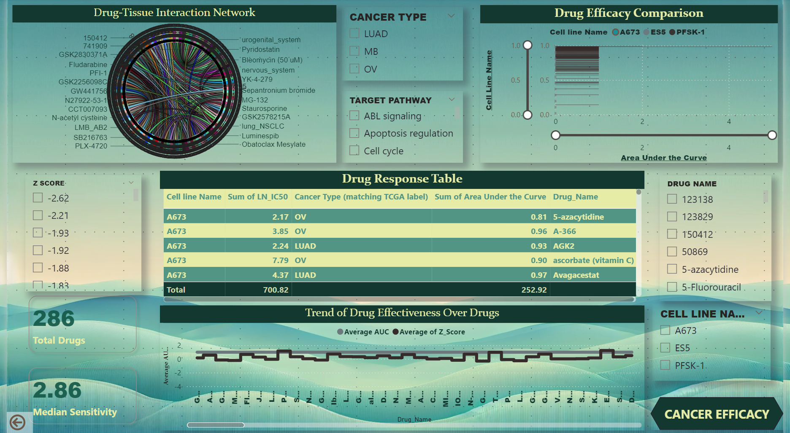
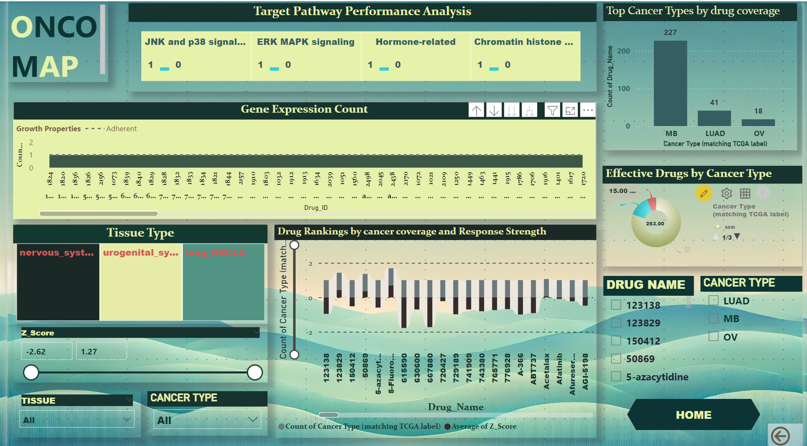

# Genomics of Drug Sensitivity in Cancer (GDSC)
## Screenshots




## Overview
The **Genomics of Drug Sensitivity in Cancer (GDSC)** project provides a comprehensive dashboard and analysis platform that integrates genomic and clinical data. It offers insights into the relationship between genetic variations and drug efficacy, empowering personalized cancer therapies.

## Key Features
- **Interactive Dashboard:** Visualizes drug response metrics by cancer type and genomic profiles.
- **Drug Sensitivity Analysis:** Identifies genetic markers influencing drug sensitivity and compares therapies across genomic subtypes.
- **Survival Analysis:** Analyzes treatment effectiveness and its correlation with patient outcomes.
- **Insights for Personalized Medicine:** Guides tailored treatment strategies, reducing trial-and-error in prescriptions.

## Data Sources
The project harmonizes data from multiple sources:
- **Genomic Data:** Variants and mutations derived from sequencing.
- **Clinical Data:** Patient demographics, treatment regimens, and outcomes.
- **Drug Data:** Sensitivity assays, efficacy metrics, and molecular targeting information.

## Key Visualizations
- Genomic variations and their correlations with drug response.
- Drug efficacy metrics, including IC50 values and response rates.
- Performance comparison of therapies across different cancer types.
- Survival analysis based on treatment and genomic profiles.

## Challenges
- Integration of large-scale genomic and clinical datasets.
- Interpreting complex biological and genomic interactions.

## Opportunities
- Utilizing AI and machine learning for predictive analysis.
- Enhancing collaboration among researchers for broader insights.
- Exploring new drug combinations for improved patient outcomes.

## Project Files
- `Genomic of Drug Sensitivity in Cancer.pbix`: Power BI dashboard file for interactive visualizations.
- `EDA(GDSC).ipynb`: Jupyter Notebook performing exploratory data analysis (EDA) on GDSC datasets.
- `ppt_GDSC.pptx`: PowerPoint presentation summarizing the project's goals, methodologies, and insights.

## Next Steps
1. Expand datasets to improve analysis accuracy and insights.
2. Investigate novel drug combinations and alternative treatments.
3. Enhance collaboration between genomic researchers and clinicians.

## How to Run the Project
1. Clone the repository:
   ```bash
   git clone https://github.com/yogeshiig/genomics-of-drug-sensitivity.git
   ```
3. Open the `EDA(GDSC).ipynb` file in Jupyter Notebook for data exploration.
4. Open the Power BI file (`Genomic of Drug Sensitivity in Cancer.pbix`) to view interactive visualizations.

## Contributions
Contributions are welcome! Please submit a pull request or open an issue for suggestions or improvements.

## License
This project is licensed under the MIT License. See `LICENSE` for details.

---
For further details, refer to the project documentation or contact the repository maintainer.

